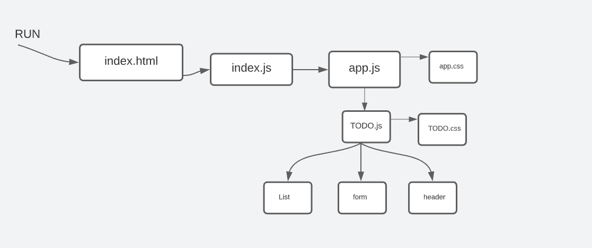

# todo-app

[github-link](https://github.com/mr-atta/todo-app)

## Phase 1

> To Do List Manager Phase 1: Incorporate configuration settings to the application

#### In Phase 1, we’re going to perform some refactoring of the To Do application as built by another team. This application mixes application state and user settings at the top level and passes things around. It was a good proof of concept, but we need to make this production ready.

### Deployment on sandbox :

 

### branch name :

> context-settings

 

## UML diagram :

 

## npm start

> npm start  
> Runs the app in the >>>> http://localhost:3000
